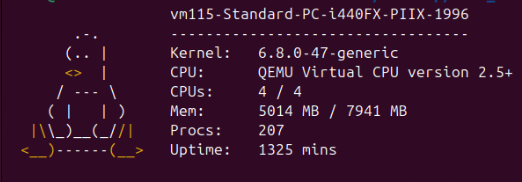

# Linux Kernel Module for System Info (kfetch)

This project implements a Linux Character Device Driver that retrieves system information (CPU, Memory, Kernel Version) directly from kernel space.

## Features
- **Kernel-Space Retrieval:** Fetches system details using internal kernel APIs.
- **Character Device Interface:** Interacts with user space via standard file operations (`open`, `read`, `release`).
- **Memory Safety:** Utilizes `kmalloc` and `copy_to_user` to ensure safe data transfer between kernel and user space.
- **Concurrency Control:** Implements Mutex locks to handle concurrent access safely.

## Preview


## Build & Run
1. **Build the module:**
   ```bash
   make
2. **Load the module:**
    ```bash
    sudo insmod kfetch_mod.ko
3. **Read system info:**
    ```bash
    sudo ./kfetch  # or: cat /dev/kfetch
4. **Unload:**
    ```bash
    sudo rmmod kfetch_mod
## Tech Stack
* C
* Linux Kernel 6.x
* Device Drivers